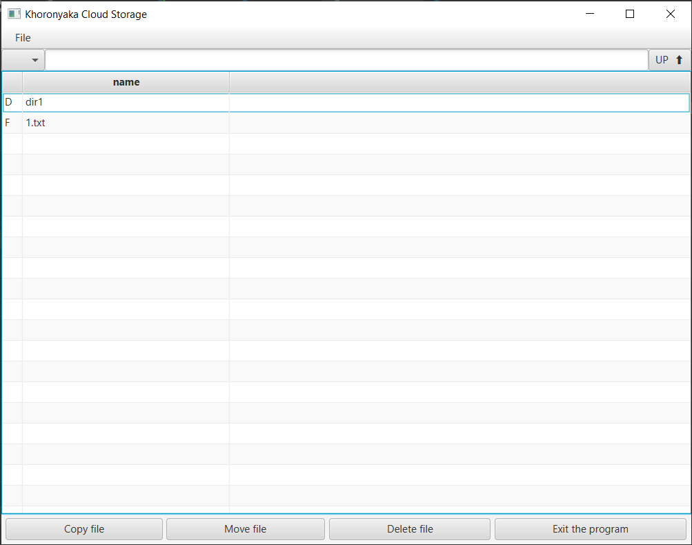

# Khoronyaka Cloud Storage

## Сделанно на сегодня:

- Работаю над CUI клиента

### Server maven java11

    - Netty на порту 8189
    - pipeline  new StringEncoder(StandardCharsets.UTF_8), // out-1
                new StringDecoder(StandardCharsets.UTF_8), // in-1
                new ChatMessageHandler() //  in-2
    - Dependencies  io.netty
                    org.slf4j
                    org.projectlombok

### Client maven javafx java11

    - CUI javafx
    - Отображает два колонки type file, name file
    - Колонка name file выводит лист файлов и директорий root
